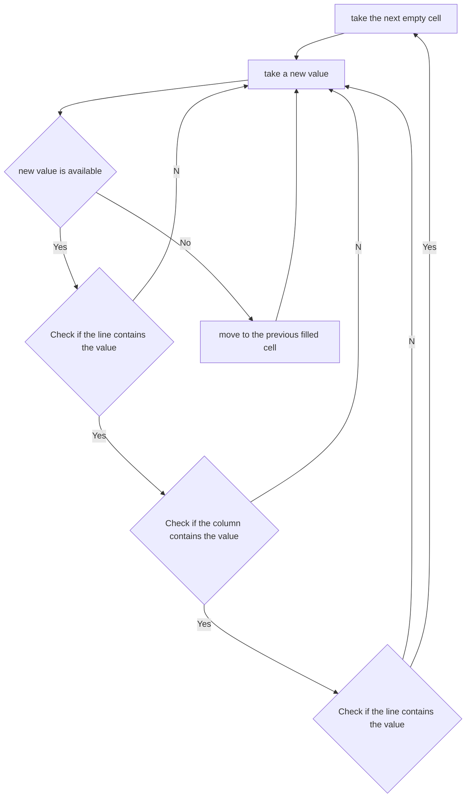

# sudoku_solver

## why another solver again

because it entertain me, and give me the opportunity to discover the python language

## what is the algorithm

This is a brute force one named [backtracking](https://en.wikipedia.org/wiki/Sudoku_solving_algorithms#backtracking)

In practice :



## installation

### requirement
you need to use python 3, I assume that python and pip refer to the version 3, if not please adapt the followings command

### instructions

I recommend to use [virtual env](https://virtualenv.pypa.io/en/latest/) but it is optional

after you need to install somes package :

```bash
pip install -r requirement.txt
```

## run

to run it simply run `python app.py`

## idea to add

* possibility to change the grid size
* change the color